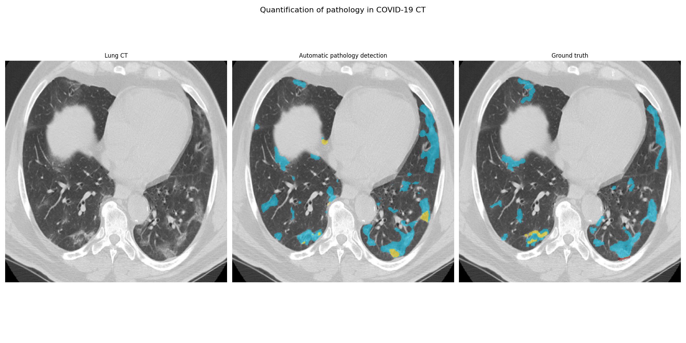

This repository provides proof of concept code for detecting pathology related to COVID-19. The figure below shows the original CT axial slice, the manually annotated ground truth and the automatic delineation of consolidation and ground glass opacity. 

Please see the following blog post for more details: [ADD LINK]



This code is based on the U-Net implementation from: https://github.com/zhixuhao/unet  

# 1) Dataset

The original dataset is provided at: 

https://www.sirm.org/2020/03/28/covid-19-caso-65/  

The annotated dataset with annotations are available at from [MedSeg](http://medicalsegmentation.com/covid19/)

To run the code, download the training images, training masks and test images from the site (`tr_im.nii.gz`, `tr_mask.nii.gz` and `val_im.nii.gz`)

and copy these files into `data/covid/` in the code directory. 

# 2) Building the environment and running the code

### Running the code in a virtual environment

Create the virtual environment  

`python3 -m venv venv`

`pip install -r requirements.txt`

To run the code  

`python3 main.py`

### (optional) Running the code using a docker container

`docker build --tag covidruntime:1.0 .`

To run the code  

`docker run --rm -it -v $(pwd):/code covidruntime:1.0 python3 main.py`  

### Output

The processed images from the test and validation set will appear in `demo_figs`

# 3) Usage

The following simple options are available in the main script:

```python
# Options 
# --------------------------------------

train_model = False
validation_size = 0.1
steps_per_epoch = 100
epochs = 200

# --------------------------------------
```

Selecting `train_model =  True` wil train the model from scratch. 


